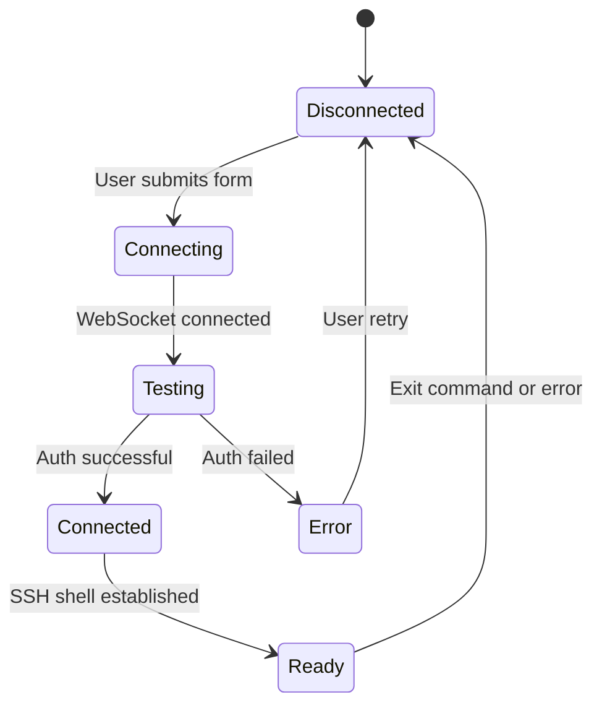

# Medusa SSH Web Terminal - Complete Project Context

## 📋 Table of Contents

1. [Project Overview](#project-overview)
2. [Current Architecture](#current-architecture)
3. [Technical Stack](#technical-stack)
4. [Core Features](#core-features)
5. [User Flow & Experience](#user-flow--experience)
6. [Component Architecture](#component-architecture)
7. [Server Implementation](#server-implementation)
8. [Authentication & Security](#authentication--security)
9. [Terminal Implementation](#terminal-implementation)
10. [State Management](#state-management)
11. [Error Handling](#error-handling)
12. [UI/UX Design](#uiux-design)
13. [React Native Migration Guide](#react-native-migration-guide)
14. [Implementation Roadmap](#implementation-roadmap)

---

## 📖 Project Overview

### **What is Medusa?**
Medusa is a web-based SSH terminal emulator that allows users to connect to remote servers directly from their browser. It provides a full terminal experience with real-time command execution, session management, and secure authentication.

### **Core Purpose**
- Eliminate the need for separate SSH clients
- Provide cross-platform SSH access through web browsers
- Offer a modern, intuitive interface for server management
- Enable secure remote server administration

### **Target Use Cases**
- Remote server administration
- Development environment access
- Quick SSH connections without installing clients
- Multi-server management from a single interface

---

## 🏗️ Current Architecture

### **System Components**

```
┌─────────────────┐    WebSocket    ┌─────────────────┐    SSH Protocol    ┌─────────────────┐
│   Frontend      │◄──────────────►│  Bridge Server  │◄─────────────────►│  Remote Server  │
│   (Next.js)     │                │   (Node.js)     │                    │   (SSH Daemon)  │
└─────────────────┘                └─────────────────┘                    └─────────────────┘
      │                                      │                                      │
      │ ► User Interface                     │ ► SSH Connection Management          │ ► Command Execution
      │ ► Session Storage                    │ ► WebSocket ↔ SSH Bridge            │ ► Shell Access
      │ ► Terminal Emulation                 │ ► Authentication Handling            │ ► File System Access
```

### **Data Flow Architecture**

#### **Connection Establishment Flow:**
```
1. User Input → 2. Credential Validation → 3. SSH Connection → 4. Shell Access
     │                     │                      │                    │
     ▼                     ▼                      ▼                    ▼
Form Submission → Pre-auth Testing → SSH2 Library → Interactive Shell
     │                     │                      │                    │
     ▼                     ▼                      ▼                    ▼
WebSocket Msg → Server Validation → TCP Connection → Terminal Ready
```

#### **Real-time Communication Flow:**
```
User Keystroke → WebSocket → Server → SSH Stream → Remote Server
     ▲                                                        │
     │                                                        ▼
Terminal Display ◄── WebSocket ◄── Server ◄── SSH Stream ◄── Command Output
```

---

## 🛠️ Technical Stack

### **Frontend (Next.js)**
```typescript
// Core Technologies
- Framework: Next.js 14+ (React 18+)
- Language: TypeScript
- Terminal: xterm.js + xterm-addon-fit
- WebSocket: Native WebSocket API
- Styling: Tailwind CSS
- State: React Hooks (useState, useEffect, useRef)
- Routing: Next.js App Router
- Storage: sessionStorage for config persistence
```

### **Backend (Node.js)**
```javascript
// Core Technologies
- Runtime: Node.js
- WebSocket: ws library
- SSH Client: ssh2 library
- Server: Basic HTTP server
- Protocol: WebSocket over HTTP/HTTPS
```

### **Dependencies Overview**
```json
{
  "frontend": {
    "next": "^14.0.0",
    "react": "^18.0.0",
    "xterm": "^5.0.0",
    "xterm-addon-fit": "^0.8.0",
    "tailwindcss": "^3.0.0"
  },
  "backend": {
    "ws": "^8.0.0",
    "ssh2": "^1.14.0"
  }
}
```

---

## ⚡ Core Features

### **1. SSH Connection Management**
```typescript
interface SSHConfig {
  host: string;           // Server hostname/IP
  port: number;          // SSH port (default: 22)
  username: string;      // SSH username
  authMethod: 'password' | 'key';
  password?: string;     // For password authentication
  privateKey?: string;   // For key-based authentication
  passphrase?: string;   // For encrypted private keys
}
```

#### **Authentication Methods:**
- **Password Authentication**: Username + password
- **Private Key Authentication**: RSA/ED25519 keys with optional passphrase
- **Keyboard Interactive**: Fallback authentication method

### **2. Terminal Emulation**
```typescript
// Terminal Configuration
const terminalConfig = {
  cursorBlink: true,
  convertEol: true,
  fontFamily: 'ui-monospace, SFMono-Regular, Menlo, monospace',
  fontSize: 14,
  fontWeight: 400,
  scrollback: 1000,
  theme: {
    background: '#0a0a0a',
    foreground: '#f5f5f5',
    cursor: '#22d3ee',
    // ... color scheme
  }
};
```

#### **Terminal Features:**
- **Real-time Command Execution**: Instant command feedback
- **Color Support**: Full 256-color terminal support
- **Scrollback Buffer**: 1000 lines of command history
- **Text Selection**: Copy/paste functionality
- **Resizing**: Automatic terminal resize on window changes
- **Cursor Blinking**: Visual cursor indication

### **3. Session Management**
```typescript
interface SessionState {
  status: 'connecting' | 'connected' | 'ready' | 'disconnected' | 'error';
  connectionId?: string;
  lastActivity: number;
  errorMessage?: string;
}
```

#### **Session Features:**
- **Connection Status Tracking**: Real-time connection state
- **Auto-reconnection**: On network interruptions
- **Session Persistence**: Survive browser refreshes (limited)
- **Graceful Disconnection**: Clean connection termination
- **Error Recovery**: Automatic error handling and user notification

### **4. Security Features**
- **Client-side Credential Storage**: sessionStorage (temporary)
- **Connection Validation**: Pre-authentication testing
- **Error Sanitization**: Safe error message display
- **Connection Timeouts**: Prevent hanging connections
- **Session Cleanup**: Automatic resource cleanup

---

## 👤 User Flow & Experience

### **1. Connection Setup Flow**
```
Home Page → Fill Connection Form → Test Credentials → Connect to Terminal
    │              │                    │                    │
    ▼              ▼                    ▼                    ▼
SSH Config → Form Validation → Pre-auth Test → Terminal Session
    │              │                    │                    │
    ▼              ▼                    ▼                    ▼
   UI Form → Client Validation → Server Test → Interactive Shell
```

#### **Step-by-step User Journey:**
1. **Landing**: User arrives at home page with connection form
2. **Input**: User enters SSH credentials (host, username, auth method)
3. **Validation**: Client-side form validation
4. **Testing**: Real-time credential testing with progress indicators
5. **Success**: Redirect to terminal page with established connection
6. **Terminal**: Full interactive terminal session
7. **Commands**: Real-time command execution and output
8. **Disconnection**: Manual disconnect or automatic on exit

### **2. Error Handling Flow**
```
Error Occurs → Error Classification → User-friendly Message → Recovery Action
     │               │                      │                    │
     ▼               ▼                      ▼                    ▼
Exception → Error Type Detection → Sanitized Display → Retry/Redirect
```

#### **Error Categories:**
- **Network Errors**: Connection refused, timeout, host not found
- **Authentication Errors**: Wrong credentials, key issues
- **SSH Errors**: Protocol errors, handshake failures
- **System Errors**: Server errors, WebSocket issues

### **3. Connection States & Transitions**


---

## 🧩 Component Architecture

### **1. Frontend Component Hierarchy**
```
App
├── HomePage
│   ├── ConnectionForm
│   │   ├── HostInput
│   │   ├── AuthMethodSelector
│   │   ├── CredentialInputs
│   │   └── ConnectButton
│   ├── ErrorDisplay
│   ├── LoadingIndicator
│   └── SavedConnections (future)
│
└── TerminalPage
    ├── TerminalHeader
    │   ├── StatusIndicator
    │   ├── ActionButtons
    │   └── TabButton
    ├── TerminalContainer
    │   └── XTermInstance
    ├── TerminalFooter
    │   └── StatusDisplay
    ├── AssistiveTouch
    └── ConfirmationDialogs
```

### **2. Component Specifications**

#### **HomePage Component**
```typescript
interface HomePageProps {}

interface HomePageState {
  host: string;
  port: number;
  username: string;
  authMethod: 'password' | 'key';
  password: string;
  privateKey: string;
  passphrase: string;
  connecting: boolean;
  connectionStatus: string;
  errorMsg: string | null;
}

// Key Functions:
- handleFormSubmission()
- testCredentials()
- handleConnectionStatus()
- redirectToTerminal()
```

#### **TerminalPage Component**
```typescript
interface TerminalPageProps {}

interface TerminalPageState {
  status: string;
  confirmOpen: boolean;
  confirmDisconnectOpen: boolean;
}

// Key Functions:
- initializeTerminal()
- establishWebSocketConnection()
- handleTerminalResize()
- sendTerminalInput()
- handleDisconnection()
```

#### **TerminalContainer Component**
```typescript
interface TerminalContainerProps {
  containerRef: RefObject<HTMLDivElement>;
}

// Key Features:
- XTerm.js integration
- Terminal fitting and resizing
- Input/output handling
- Theme application
```

### **3. Hook Architecture**
```typescript
// Custom hooks for reusable logic
const useSSHConnection = (config: SSHConfig) => {
  // WebSocket connection management
  // SSH authentication
  // Error handling
};

const useTerminal = (containerRef: RefObject<HTMLDivElement>) => {
  // Terminal initialization
  // Fit addon management
  // Theme application
};

const useSessionStorage = <T>(key: string, defaultValue: T) => {
  // Persistent storage management
  // Error handling for storage operations
};
```

---

## 🖥️ Server Implementation

### **1. WebSocket Server Architecture**
```javascript
// Core Server Structure
const server = http.createServer();
const wss = new WebSocketServer({ server });

// Connection handling
wss.on('connection', (ws) => {
  // Per-connection state
  let ssh;           // SSH2 client instance
  let shellStream;   // Interactive shell stream
  let heartbeat;     // Connection keepalive
  
  // Message routing
  ws.on('message', handleMessage);
  ws.on('close', cleanup);
  ws.on('error', handleError);
});
```

### **2. Message Protocol**
```typescript
// Client → Server Messages
interface ClientMessage {
  type: 'connect' | 'test-connection' | 'input' | 'resize' | 'disconnect';
  config?: SSHConfig;
  data?: string;
  cols?: number;
  rows?: number;
}

// Server → Client Messages
interface ServerMessage {
  type: 'ready' | 'data' | 'close' | 'error' | 'test-success' | 'test-error' | 'test-progress';
  data?: string;
  error?: string;
  message?: string;
}
```

### **3. SSH Connection Management**
```javascript
// SSH Connection Lifecycle
const handleConnect = (config, cols, rows) => {
  ssh = new Client();
  
  ssh.on('ready', () => {
    // Establish shell session
    ssh.shell({ cols, rows, term: 'xterm-256color' }, (err, stream) => {
      shellStream = stream;
      bindStreamEvents(stream);
    });
  });
  
  ssh.on('error', handleSSHError);
  ssh.on('end', handleSSHEnd);
  
  ssh.connect({
    host: config.host,
    port: config.port,
    username: config.username,
    password: config.password,
    privateKey: config.privateKey,
    passphrase: config.passphrase,
    keepaliveInterval: 15000,
    keepaliveCountMax: 10
  });
};
```

### **4. Error Handling & Recovery**
```javascript
// Comprehensive error handling
const handleSSHError = (err) => {
  let errorMessage = String(err?.message || err);
  
  // Categorize and humanize errors
  if (errorMessage.includes('ENOTFOUND')) {
    errorMessage = 'Host not found. Please check the hostname/IP address.';
  } else if (errorMessage.includes('ECONNREFUSED')) {
    errorMessage = 'Connection refused. Please check the host and port.';
  } else if (errorMessage.includes('Authentication')) {
    errorMessage = 'Authentication failed. Please check your credentials.';
  }
  
  ws.send(JSON.stringify({ type: 'error', error: errorMessage }));
};
```

### **5. Connection Testing Implementation**
```javascript
// Pre-authentication testing
const handleTestConnection = (config) => {
  const testSsh = new Client();
  let isCompleted = false;
  
  // Timeout protection
  const timeout = setTimeout(() => {
    if (!isCompleted) {
      isCompleted = true;
      testSsh.end();
      ws.send(JSON.stringify({
        type: 'test-error',
        error: 'Connection timeout. Authentication took too long.'
      }));
    }
  }, 10000);
  
  testSsh.on('ready', () => {
    if (!isCompleted) {
      isCompleted = true;
      clearTimeout(timeout);
      testSsh.end();
      ws.send(JSON.stringify({ type: 'test-success' }));
    }
  });
  
  // Connect with shorter timeout for testing
  testSsh.connect({
    ...config,
    readyTimeout: 8000,
    tryKeyboard: false
  });
};
```

---

## 🔐 Authentication & Security

### **1. Authentication Methods**

#### **Password Authentication**
```typescript
interface PasswordAuth {
  authMethod: 'password';
  username: string;
  password: string;
}

// Implementation
ssh.connect({
  host: config.host,
  username: config.username,
  password: config.password
});
```

#### **Private Key Authentication**
```typescript
interface KeyAuth {
  authMethod: 'key';
  username: string;
  privateKey: string;    // PEM or OpenSSH format
  passphrase?: string;   // For encrypted keys
}

// Implementation
ssh.connect({
  host: config.host,
  username: config.username,
  privateKey: config.privateKey,
  passphrase: config.passphrase
});
```

### **2. Security Considerations**

#### **Current Security Model**
- **Client Storage**: Credentials in sessionStorage (temporary)
- **Transport**: WebSocket (ws:// or wss://)
- **Server**: Local development server assumption
- **Authentication**: Direct SSH credential passing

#### **Security Risks**
- **Credential Exposure**: Plaintext in browser memory
- **Transport Security**: Unencrypted WebSocket traffic
- **Server Trust**: No authentication for WebSocket server
- **Session Management**: No secure session tokens

#### **Security Improvements for Production**
```typescript
// Enhanced security measures
interface SecureConfig {
  // Encrypted credential storage
  encryptedCredentials: string;
  
  // Server authentication
  serverToken: string;
  
  // Connection encryption
  tlsEnabled: boolean;
  
  // Session management
  sessionId: string;
  sessionTimeout: number;
}
```

### **3. Error Sanitization**
```javascript
// Safe error message handling
const sanitizeError = (error) => {
  const errorMessage = String(error?.message || error);
  
  // Remove sensitive information
  const sanitized = errorMessage
    .replace(/password.*$/i, 'password [REDACTED]')
    .replace(/key.*$/i, 'key [REDACTED]')
    .replace(/passphrase.*$/i, 'passphrase [REDACTED]');
  
  return sanitized;
};
```

---

## 💻 Terminal Implementation

### **1. XTerm.js Integration**
```typescript
// Terminal initialization
const initializeTerminal = () => {
  const term = new Terminal({
    cursorBlink: true,
    convertEol: true,
    fontFamily: 'ui-monospace, SFMono-Regular, Menlo, monospace',
    fontSize: 14,
    fontWeight: 400,
    scrollback: 1000,
    theme: {
      background: '#0a0a0a',
      foreground: '#f5f5f5',
      cursor: '#22d3ee',
      cursorAccent: '#0a0a0a',
      selectionBackground: '#2563eb55',
      // Full color palette...
    }
  });
  
  const fitAddon = new FitAddon();
  term.loadAddon(fitAddon);
  
  return { term, fitAddon };
};
```

### **2. Terminal Features Implementation**

#### **Auto-fitting & Resizing**
```typescript
// Responsive terminal sizing
const handleResize = () => {
  if (fitAddon && wsRef.current) {
    fitAddon.fit();
    
    // Notify server of new dimensions
    wsRef.current.send(JSON.stringify({
      type: 'resize',
      cols: term.cols,
      rows: term.rows
    }));
  }
};

// Observe container size changes
const resizeObserver = new ResizeObserver(handleResize);
resizeObserver.observe(containerRef.current);
```

#### **Input Handling**
```typescript
// Terminal input processing
term.onData((data) => {
  // Send user input to server
  wsRef.current?.send(JSON.stringify({
    type: 'input',
    data: data
  }));
});

// Special key handling
term.attachCustomKeyEventHandler((event) => {
  // Handle special key combinations
  if (event.ctrlKey && event.key === 'c') {
    // Send SIGINT
    return false;
  }
  return true;
});
```

#### **Output Processing**
```typescript
// Handle server output
ws.addEventListener('message', (event) => {
  const message = JSON.parse(event.data);
  
  if (message.type === 'data') {
    // Write server output to terminal
    term.write(message.data);
  }
});
```

### **3. Terminal Theming**
```typescript
// Dark theme configuration
const darkTheme = {
  background: '#0a0a0a',
  foreground: '#f5f5f5',
  cursor: '#22d3ee',
  cursorAccent: '#0a0a0a',
  selectionBackground: '#2563eb55',
  black: '#1e1e1e',
  red: '#ff4d4f',
  green: '#22c55e',
  yellow: '#facc15',
  blue: '#3b82f6',
  magenta: '#d946ef',
  cyan: '#06b6d4',
  white: '#e5e7eb',
  brightBlack: '#737373',
  brightRed: '#ff6b6b',
  brightGreen: '#34d399',
  brightYellow: '#fde047',
  brightBlue: '#60a5fa',
  brightMagenta: '#e879f9',
  brightCyan: '#22d3ee',
  brightWhite: '#ffffff'
};
```

### **4. Performance Optimizations**
```typescript
// Terminal performance enhancements
const performanceConfig = {
  // Limit scrollback for memory management
  scrollback: 1000,
  
  // Optimize rendering
  rendererType: 'canvas',
  
  // Batch output for better performance
  outputBatching: true,
  
  // Debounce resize events
  resizeDebounceMs: 100
};
```

---

## 🎛️ State Management

### **1. Component State Architecture**
```typescript
// HomePage state management
interface HomePageState {
  // Form data
  formData: SSHConfig;
  
  // UI states
  connecting: boolean;
  connectionStatus: string;
  errorMsg: string | null;
  
  // Connection management
  wsConnection: WebSocket | null;
  authTimeout: NodeJS.Timeout | null;
}

// TerminalPage state management
interface TerminalPageState {
  // Connection state
  status: string;
  readyState: boolean;
  
  // UI states
  confirmOpen: boolean;
  confirmDisconnectOpen: boolean;
  
  // Terminal references
  termRef: RefObject<Terminal>;
  fitRef: RefObject<FitAddon>;
  wsRef: RefObject<WebSocket>;
  containerRef: RefObject<HTMLDivElement>;
}
```

### **2. Session Storage Management**
```typescript
// Configuration persistence
const saveSSHConfig = (config: SSHConfig) => {
  try {
    sessionStorage.setItem('sshConfig', JSON.stringify(config));
  } catch (error) {
    console.error('Failed to save SSH config:', error);
  }
};

const loadSSHConfig = (): SSHConfig | null => {
  try {
    const raw = sessionStorage.getItem('sshConfig');
    return raw ? JSON.parse(raw) : null;
  } catch (error) {
    console.error('Failed to load SSH config:', error);
    return null;
  }
};

const clearSSHConfig = () => {
  try {
    sessionStorage.removeItem('sshConfig');
  } catch (error) {
    console.error('Failed to clear SSH config:', error);
  }
};
```

### **3. Connection State Management**
```typescript
// WebSocket connection lifecycle
const manageConnection = () => {
  const [connectionState, setConnectionState] = useState<{
    status: 'disconnected' | 'connecting' | 'connected' | 'ready' | 'error';
    error?: string;
    lastActivity: number;
  }>({
    status: 'disconnected',
    lastActivity: Date.now()
  });
  
  const updateConnectionState = (newState: Partial<typeof connectionState>) => {
    setConnectionState(prev => ({
      ...prev,
      ...newState,
      lastActivity: Date.now()
    }));
  };
  
  return { connectionState, updateConnectionState };
};
```

### **4. Error State Management**
```typescript
// Centralized error handling
interface ErrorState {
  hasError: boolean;
  errorType: 'network' | 'auth' | 'ssh' | 'system';
  errorMessage: string;
  errorCode?: string;
  recoverable: boolean;
  retryCount: number;
}

const useErrorManagement = () => {
  const [errorState, setErrorState] = useState<ErrorState>({
    hasError: false,
    errorType: 'system',
    errorMessage: '',
    recoverable: true,
    retryCount: 0
  });
  
  const handleError = (error: Error, type: ErrorState['errorType']) => {
    setErrorState({
      hasError: true,
      errorType: type,
      errorMessage: error.message,
      recoverable: type !== 'auth',
      retryCount: errorState.retryCount + 1
    });
  };
  
  const clearError = () => {
    setErrorState(prev => ({ ...prev, hasError: false }));
  };
  
  return { errorState, handleError, clearError };
};
```

---

## 🚨 Error Handling

### **1. Error Classification System**
```typescript
enum ErrorType {
  NETWORK = 'network',
  AUTHENTICATION = 'auth',
  SSH_PROTOCOL = 'ssh',
  SYSTEM = 'system',
  TIMEOUT = 'timeout'
}

interface ErrorInfo {
  type: ErrorType;
  code: string;
  message: string;
  userMessage: string;
  recoverable: boolean;
  retryable: boolean;
}
```

### **2. Error Mapping & User Messages**
```typescript
const errorMap: Record<string, ErrorInfo> = {
  'ENOTFOUND': {
    type: ErrorType.NETWORK,
    code: 'HOST_NOT_FOUND',
    message: 'getaddrinfo ENOTFOUND',
    userMessage: 'Host not found. Please check the hostname or IP address.',
    recoverable: true,
    retryable: true
  },
  'ECONNREFUSED': {
    type: ErrorType.NETWORK,
    code: 'CONNECTION_REFUSED',
    message: 'connect ECONNREFUSED',
    userMessage: 'Connection refused. Please check the host and port number.',
    recoverable: true,
    retryable: true
  },
  'Authentication failed': {
    type: ErrorType.AUTHENTICATION,
    code: 'AUTH_FAILED',
    message: 'All configured authentication methods failed',
    userMessage: 'Authentication failed. Please check your username and password.',
    recoverable: true,
    retryable: true
  },
  'ETIMEDOUT': {
    type: ErrorType.TIMEOUT,
    code: 'CONNECTION_TIMEOUT',
    message: 'connect ETIMEDOUT',
    userMessage: 'Connection timed out. Please check your network connectivity.',
    recoverable: true,
    retryable: true
  }
};
```

### **3. Error Recovery Strategies**
```typescript
// Automatic retry logic
const useRetryLogic = () => {
  const [retryCount, setRetryCount] = useState(0);
  const maxRetries = 3;
  
  const executeWithRetry = async (operation: () => Promise<any>) => {
    for (let attempt = 0; attempt <= maxRetries; attempt++) {
      try {
        const result = await operation();
        setRetryCount(0);
        return result;
      } catch (error) {
        if (attempt === maxRetries) {
          throw error;
        }
        
        // Exponential backoff
        const delay = Math.pow(2, attempt) * 1000;
        await new Promise(resolve => setTimeout(resolve, delay));
        setRetryCount(attempt + 1);
      }
    }
  };
  
  return { executeWithRetry, retryCount };
};
```

### **4. Error UI Components**
```typescript
// Error display component
interface ErrorDisplayProps {
  error: ErrorInfo;
  onRetry?: () => void;
  onDismiss?: () => void;
}

const ErrorDisplay: React.FC<ErrorDisplayProps> = ({ error, onRetry, onDismiss }) => {
  const getErrorStyles = (type: ErrorType) => {
    switch (type) {
      case ErrorType.NETWORK:
        return 'border-yellow-600 bg-yellow-600/10 text-yellow-100';
      case ErrorType.AUTHENTICATION:
        return 'border-red-600 bg-red-600/10 text-red-100';
      case ErrorType.SSH_PROTOCOL:
        return 'border-purple-600 bg-purple-600/10 text-purple-100';
      default:
        return 'border-red-600 bg-red-600/10 text-red-100';
    }
  };
  
  return (
    <div className={`p-4 rounded-lg border ${getErrorStyles(error.type)}`}>
      <div className="flex items-center justify-between">
        <div>
          <h3 className="font-semibold">{error.type.toUpperCase()} Error</h3>
          <p>{error.userMessage}</p>
        </div>
        <div className="flex gap-2">
          {error.retryable && onRetry && (
            <button onClick={onRetry} className="px-3 py-1 bg-blue-600 rounded">
              Retry
            </button>
          )}
          {onDismiss && (
            <button onClick={onDismiss} className="px-2 py-1">×</button>
          )}
        </div>
      </div>
    </div>
  );
};
```

---

## 🎨 UI/UX Design

### **1. Design System**

#### **Color Palette**
```css
/* Primary Colors */
--bg-primary: #0a0a0a;      /* Terminal background */
--bg-secondary: #1a1a1a;    /* Card backgrounds */
--bg-tertiary: #2a2a2a;     /* Input backgrounds */

/* Text Colors */
--text-primary: #f5f5f5;    /* Primary text */
--text-secondary: #a1a1aa;  /* Secondary text */
--text-muted: #71717a;      /* Muted text */

/* Accent Colors */
--accent-blue: #3b82f6;     /* Primary actions */
--accent-cyan: #22d3ee;     /* Terminal cursor */
--accent-green: #22c55e;    /* Success states */
--accent-red: #ef4444;      /* Error states */
--accent-yellow: #f59e0b;   /* Warning states */

/* Border Colors */
--border-primary: #374151;  /* Default borders */
--border-secondary: #4b5563; /* Hover borders */
```

#### **Typography Scale**
```css
/* Font Families */
--font-mono: ui-monospace, SFMono-Regular, Menlo, monospace;
--font-sans: ui-sans-serif, system-ui, sans-serif;

/* Font Sizes */
--text-xs: 0.75rem;    /* 12px */
--text-sm: 0.875rem;   /* 14px */
--text-base: 1rem;     /* 16px */
--text-lg: 1.125rem;   /* 18px */
--text-xl: 1.25rem;    /* 20px */
--text-2xl: 1.5rem;    /* 24px */
```

#### **Spacing System**
```css
/* Spacing Scale */
--space-1: 0.25rem;    /* 4px */
--space-2: 0.5rem;     /* 8px */
--space-3: 0.75rem;    /* 12px */
--space-4: 1rem;       /* 16px */
--space-6: 1.5rem;     /* 24px */
--space-8: 2rem;       /* 32px */
```

### **2. Component Design Specifications**

#### **Connection Form Design**
```typescript
const connectionFormStyles = {
  container: `
    max-w-2xl mx-auto p-8
    bg-gradient-to-br from-gray-900 to-gray-800
    rounded-xl shadow-2xl
  `,
  
  input: `
    w-full px-4 py-3 rounded-lg
    bg-gray-800 border border-gray-600
    text-gray-100 placeholder-gray-400
    focus:border-blue-500 focus:ring-2 focus:ring-blue-500/20
    transition-all duration-200
  `,
  
  button: `
    w-full px-6 py-3 rounded-lg
    bg-blue-600 hover:bg-blue-700
    text-white font-medium
    disabled:opacity-50 disabled:cursor-not-allowed
    transition-all duration-200
    flex items-center justify-center gap-2
  `,
  
  errorAlert: `
    p-4 rounded-lg border
    border-red-500/50 bg-red-500/10
    text-red-100
    flex items-center gap-3
  `
};
```

#### **Terminal Interface Design**
```typescript
const terminalStyles = {
  container: `
    h-screen flex flex-col
    bg-gray-900 text-gray-100
  `,
  
  header: `
    sticky top-0 z-10
    flex items-center gap-2 px-4 py-3
    border-b border-gray-700 bg-gray-900
  `,
  
  terminal: `
    flex-1 overflow-hidden
    bg-black
  `,
  
  footer: `
    sticky bottom-0 z-10
    flex items-center gap-2 px-4 py-3
    border-t border-gray-700 bg-gray-900
  `,
  
  statusIndicator: `
    flex items-center gap-2
    px-3 py-1 rounded-full
    text-sm font-medium
  `
};
```

### **3. Responsive Design**
```css
/* Mobile-first responsive design */
@media (max-width: 768px) {
  .terminal-container {
    font-size: 12px;
  }
  
  .connection-form {
    padding: 1rem;
    margin: 1rem;
  }
  
  .terminal-header {
    padding: 0.75rem;
  }
}

@media (min-width: 768px) {
  .terminal-container {
    font-size: 14px;
  }
}

@media (min-width: 1024px) {
  .connection-form {
    max-width: 720px;
  }
}
```

### **4. Animation & Transitions**
```css
/* Loading animations */
@keyframes spin {
  to { transform: rotate(360deg); }
}

.loading-spinner {
  animation: spin 1s linear infinite;
}

/* Connection status transitions */
.status-indicator {
  transition: all 0.3s ease-in-out;
}

.status-connecting {
  background: linear-gradient(90deg, #3b82f6, #1d4ed8);
  animation: pulse 2s infinite;
}

.status-connected {
  background: linear-gradient(90deg, #22c55e, #16a34a);
}

.status-error {
  background: linear-gradient(90deg, #ef4444, #dc2626);
}

/* Terminal cursor blink */
@keyframes blink {
  0%, 50% { opacity: 1; }
  51%, 100% { opacity: 0; }
}

.terminal-cursor {
  animation: blink 1s infinite;
}
```

---

## 📱 React Native Migration Guide

### **1. Architecture Transformation**

#### **Current Web Architecture:**
```
Next.js Frontend → WebSocket Server → SSH2 Library → Remote Server
```

#### **Target React Native Architecture:**
```
React Native App → Native SSH Module → Direct SSH Connection
```

### **2. Component Migration Strategy**

#### **Direct Component Ports:**
```typescript
// HomePage → ConnectionScreen
interface ConnectionScreenProps {
  navigation: NavigationProp<any>;
}

// TerminalPage → TerminalScreen  
interface TerminalScreenProps {
  route: RouteProp<any>;
  navigation: NavigationProp<any>;
}

// Form components → Native form components
// Error handling → Native alert/modal systems
// Loading states → Native activity indicators
```

#### **Native Module Requirements:**
```typescript
// SSH Native Module Interface
interface SSHNativeModule {
  connect(config: SSHConfig): Promise<string>;
  disconnect(): Promise<void>;
  sendCommand(command: string): Promise<string>;
  sendInput(input: string): Promise<void>;
  onOutput(callback: (output: string) => void): void;
  onError(callback: (error: string) => void): void;
  onDisconnect(callback: () => void): void;
}
```

### **3. Technology Stack Migration**

#### **Frontend Framework:**
```bash
# From Next.js to React Native
npm install -g @react-native-community/cli
npx react-native init MedusaSSH
```

#### **Navigation:**
```bash
# React Navigation for screen management
npm install @react-navigation/native
npm install @react-navigation/stack
npm install react-native-screens react-native-safe-area-context
```

#### **Terminal Implementation:**
```bash
# Terminal emulation options
npm install react-native-terminal-component
# OR create custom terminal view with TextInput/ScrollView
```

#### **SSH Implementation:**
```bash
# Native SSH dependencies (Android)
# Add to android/app/build.gradle:
implementation 'com.hierynomus:sshj:0.35.0'
implementation 'org.bouncycastle:bcprov-jdk15on:1.70'
```

### **4. Data Persistence Migration**

#### **From sessionStorage to AsyncStorage:**
```typescript
// Web (current)
sessionStorage.setItem('sshConfig', JSON.stringify(config));

// React Native (target)
import AsyncStorage from '@react-native-async-storage/async-storage';
await AsyncStorage.setItem('sshConfig', JSON.stringify(config));
```

#### **Secure Storage for Credentials:**
```typescript
// React Native Keychain for secure credential storage
import Keychain from 'react-native-keychain';

const storeCredentials = async (server: string, username: string, password: string) => {
  await Keychain.setInternetCredentials(server, username, password);
};

const getCredentials = async (server: string) => {
  const credentials = await Keychain.getInternetCredentials(server);
  return credentials;
};
```

### **5. Platform-Specific Implementations**

#### **Android SSH Module (Kotlin):**
```kotlin
@ReactModule(name = "SSHModule")
class SSHModule(reactContext: ReactApplicationContext) : ReactContextBaseJavaModule(reactContext) {
    
    private var sshClient: SSHClient? = null
    private var session: Session? = null
    private var shell: Session.Shell? = null
    
    @ReactMethod
    fun connect(config: ReadableMap, promise: Promise) {
        try {
            sshClient = SSHClient().apply {
                addHostKeyVerifier(PromiscuousVerifier())
                connect(config.getString("host"), config.getInt("port"))
                
                when (config.getString("authMethod")) {
                    "password" -> authPassword(
                        config.getString("username"),
                        config.getString("password")
                    )
                    "key" -> authPublickey(
                        config.getString("username"),
                        config.getString("privateKey")
                    )
                }
            }
            
            session = sshClient?.startSession()
            shell = session?.allocateDefaultPTY()?.let { session?.shell() }
            
            promise.resolve("Connected successfully")
        } catch (e: Exception) {
            promise.reject("SSH_ERROR", e.message, e)
        }
    }
    
    @ReactMethod
    fun sendInput(input: String, promise: Promise) {
        try {
            shell?.outputStream?.write(input.toByteArray())
            shell?.outputStream?.flush()
            promise.resolve(null)
        } catch (e: Exception) {
            promise.reject("INPUT_ERROR", e.message, e)
        }
    }
    
    @ReactMethod
    fun addListener(eventName: String) {
        // Required for event emitter
    }
    
    @ReactMethod
    fun removeListeners(count: Int) {
        // Required for event emitter
    }
}
```

#### **iOS SSH Module (Objective-C/Swift):**
```swift
@objc(SSHModule)
class SSHModule: RCTEventEmitter {
    
    private var sshClient: NMSSHSession?
    private var channel: NMSSHChannel?
    
    @objc
    func connect(_ config: NSDictionary, resolver: @escaping RCTPromiseResolveBlock, rejecter: @escaping RCTPromiseRejectBlock) {
        
        guard let host = config["host"] as? String,
              let username = config["username"] as? String else {
            rejecter("INVALID_CONFIG", "Missing required fields", nil)
            return
        }
        
        sshClient = NMSSHSession(host: host, andUsername: username)
        
        do {
            try sshClient?.connect()
            
            if config["authMethod"] as? String == "password" {
                let password = config["password"] as? String ?? ""
                try sshClient?.authenticate(byPassword: password)
            }
            
            channel = sshClient?.channel
            try channel?.startShell()
            
            resolver("Connected successfully")
        } catch {
            rejecter("SSH_ERROR", error.localizedDescription, error)
        }
    }
    
    override func supportedEvents() -> [String]! {
        return ["onOutput", "onError", "onDisconnect"]
    }
}
```

### **6. UI Component Migration**

#### **Terminal Interface:**
```typescript
// React Native Terminal Component
import React, { useState, useEffect, useRef } from 'react';
import { View, ScrollView, TextInput, Text, StyleSheet } from 'react-native';

const TerminalScreen: React.FC = () => {
  const [output, setOutput] = useState('');
  const [input, setInput] = useState('');
  const scrollViewRef = useRef<ScrollView>(null);
  
  useEffect(() => {
    // Scroll to bottom on new output
    scrollViewRef.current?.scrollToEnd({ animated: true });
  }, [output]);
  
  const handleInput = (text: string) => {
    setInput(text);
    if (text.endsWith('\n')) {
      SSHModule.sendInput(text);
      setInput('');
    }
  };
  
  return (
    <View style={styles.container}>
      <ScrollView 
        ref={scrollViewRef}
        style={styles.outputContainer}
        showsVerticalScrollIndicator={false}
      >
        <Text style={styles.outputText}>{output}</Text>
      </ScrollView>
      
      <TextInput
        style={styles.inputField}
        value={input}
        onChangeText={handleInput}
        placeholder="Enter command..."
        placeholderTextColor="#666"
        multiline
        autoCapitalize="none"
        autoCorrect={false}
        spellCheck={false}
      />
    </View>
  );
};

const styles = StyleSheet.create({
  container: {
    flex: 1,
    backgroundColor: '#0a0a0a',
  },
  outputContainer: {
    flex: 1,
    padding: 10,
  },
  outputText: {
    fontFamily: 'monospace',
    fontSize: 14,
    color: '#f5f5f5',
    lineHeight: 20,
  },
  inputField: {
    backgroundColor: '#1a1a1a',
    color: '#f5f5f5',
    fontFamily: 'monospace',
    fontSize: 14,
    padding: 15,
    borderTopWidth: 1,
    borderTopColor: '#333',
    minHeight: 50,
  },
});
```

### **7. State Management Migration**

#### **From React Hooks to React Native State:**
```typescript
// Enhanced state management for React Native
import { create } from 'zustand';
import AsyncStorage from '@react-native-async-storage/async-storage';

interface SSHStore {
  // Connection state
  isConnected: boolean;
  connectionStatus: string;
  currentSession: SSHConfig | null;
  
  // Terminal state
  terminalOutput: string;
  commandHistory: string[];
  
  // Saved connections
  savedConnections: SSHConfig[];
  
  // Actions
  setConnectionStatus: (status: string) => void;
  addOutput: (output: string) => void;
  addToHistory: (command: string) => void;
  saveConnection: (config: SSHConfig) => void;
  loadSavedConnections: () => Promise<void>;
}

const useSSHStore = create<SSHStore>((set, get) => ({
  isConnected: false,
  connectionStatus: 'disconnected',
  currentSession: null,
  terminalOutput: '',
  commandHistory: [],
  savedConnections: [],
  
  setConnectionStatus: (status) => set({ connectionStatus: status }),
  
  addOutput: (output) => set((state) => ({
    terminalOutput: state.terminalOutput + output
  })),
  
  addToHistory: (command) => set((state) => ({
    commandHistory: [...state.commandHistory, command].slice(-100) // Keep last 100 commands
  })),
  
  saveConnection: async (config) => {
    const connections = [...get().savedConnections, config];
    set({ savedConnections: connections });
    await AsyncStorage.setItem('savedConnections', JSON.stringify(connections));
  },
  
  loadSavedConnections: async () => {
    try {
      const saved = await AsyncStorage.getItem('savedConnections');
      if (saved) {
        set({ savedConnections: JSON.parse(saved) });
      }
    } catch (error) {
      console.error('Failed to load saved connections:', error);
    }
  }
}));
```

### **8. Navigation Structure**

#### **React Native Navigation Setup:**
```typescript
// App.tsx
import React from 'react';
import { NavigationContainer } from '@react-navigation/native';
import { createStackNavigator } from '@react-navigation/stack';

import ConnectionScreen from './src/screens/ConnectionScreen';
import TerminalScreen from './src/screens/TerminalScreen';
import SavedConnectionsScreen from './src/screens/SavedConnectionsScreen';

const Stack = createStackNavigator();

const App: React.FC = () => {
  return (
    <NavigationContainer>
      <Stack.Navigator 
        initialRouteName="Connection"
        screenOptions={{
          headerStyle: { backgroundColor: '#1a1a1a' },
          headerTintColor: '#f5f5f5',
          headerTitleStyle: { fontWeight: 'bold' }
        }}
      >
        <Stack.Screen 
          name="Connection" 
          component={ConnectionScreen}
          options={{ title: 'SSH Connection' }}
        />
        <Stack.Screen 
          name="Terminal" 
          component={TerminalScreen}
          options={{ title: 'SSH Terminal' }}
        />
        <Stack.Screen 
          name="SavedConnections" 
          component={SavedConnectionsScreen}
          options={{ title: 'Saved Connections' }}
        />
      </Stack.Navigator>
    </NavigationContainer>
  );
};

export default App;
```

---

## 🛣️ Implementation Roadmap

### **Phase 1: Foundation (Week 1-2)**

#### **Milestone 1.1: Project Setup**
- [ ] Initialize React Native project
- [ ] Set up development environment (Android Studio, Xcode)
- [ ] Configure build tools and dependencies
- [ ] Set up project structure and navigation

#### **Milestone 1.2: Basic UI Implementation**
- [ ] Create connection form screen
- [ ] Implement input validation
- [ ] Design terminal screen layout
- [ ] Add basic navigation between screens

#### **Milestone 1.3: Native Module Foundation**
- [ ] Create SSH native module structure (Android)
- [ ] Set up SSH library dependencies
- [ ] Implement basic connection interface
- [ ] Add error handling framework

### **Phase 2: Core SSH Functionality (Week 3-4)**

#### **Milestone 2.1: SSH Connection**
- [ ] Implement SSH connection logic
- [ ] Add authentication methods (password, key)
- [ ] Handle connection errors and timeouts
- [ ] Test connection establishment

#### **Milestone 2.2: Terminal Communication**
- [ ] Implement command sending
- [ ] Set up output receiving
- [ ] Handle real-time terminal interaction
- [ ] Add terminal resizing support

#### **Milestone 2.3: Session Management**
- [ ] Implement connection persistence
- [ ] Add session state tracking
- [ ] Handle disconnection scenarios
- [ ] Test session recovery

### **Phase 3: Enhanced Features (Week 5-6)**

#### **Milestone 3.1: Data Persistence**
- [ ] Implement connection saving/loading
- [ ] Add secure credential storage
- [ ] Create connection history
- [ ] Test data migration

#### **Milestone 3.2: Advanced Terminal Features**
- [ ] Implement terminal theming
- [ ] Add command history
- [ ] Support file transfer (SFTP)
- [ ] Optimize terminal performance

#### **Milestone 3.3: Error Handling & Recovery**
- [ ] Comprehensive error categorization
- [ ] User-friendly error messages
- [ ] Automatic retry mechanisms
- [ ] Connection recovery strategies

### **Phase 4: Polish & Distribution (Week 7-8)**

#### **Milestone 4.1: Testing & Quality Assurance**
- [ ] Unit testing for core functions
- [ ] Integration testing for SSH flows
- [ ] Performance testing and optimization
- [ ] Security audit and improvements

#### **Milestone 4.2: UI/UX Polish**
- [ ] Refine visual design
- [ ] Improve accessibility
- [ ] Add animations and transitions
- [ ] Optimize for different screen sizes

#### **Milestone 4.3: Build & Distribution**
- [ ] Configure release builds
- [ ] Set up app signing
- [ ] Create store listings
- [ ] Prepare documentation

### **Success Metrics**

#### **Technical Metrics:**
- [ ] Connection establishment time < 5 seconds
- [ ] Zero crashes during normal operation
- [ ] Memory usage < 50MB during operation
- [ ] Support for 99% of standard SSH servers

#### **User Experience Metrics:**
- [ ] Intuitive connection setup (< 30 seconds)
- [ ] Responsive terminal interaction (< 100ms latency)
- [ ] Reliable session persistence (95%+ success rate)
- [ ] Clear error messages and recovery paths

#### **Platform Metrics:**
- [ ] Android 7.0+ compatibility
- [ ] iOS 12.0+ compatibility
- [ ] App size < 20MB
- [ ] Battery usage optimization

---

## 📚 Additional Resources

### **Technical Documentation:**
- [SSH2 Library Documentation](https://github.com/mscdex/ssh2)
- [XTerm.js Documentation](https://xtermjs.org/)
- [React Native Documentation](https://reactnative.dev/)
- [SSHJ Library Documentation](https://github.com/hierynomus/sshj)

### **Security Guidelines:**
- [SSH Security Best Practices](https://www.ssh.com/academy/ssh/security)
- [Mobile App Security Guidelines](https://owasp.org/www-project-mobile-top-10/)
- [React Native Security Guidelines](https://reactnative.dev/docs/security)

### **Performance Optimization:**
- [React Native Performance](https://reactnative.dev/docs/performance)
- [Terminal Emulator Optimization](https://xtermjs.org/docs/guides/performance/)
- [Mobile App Performance Best Practices](https://developer.android.com/topic/performance)

---

**This document serves as the complete reference for understanding, maintaining, and migrating the Medusa SSH Web Terminal project. It provides all necessary context for LLM agents to assist with development, troubleshooting, and feature enhancement.**
